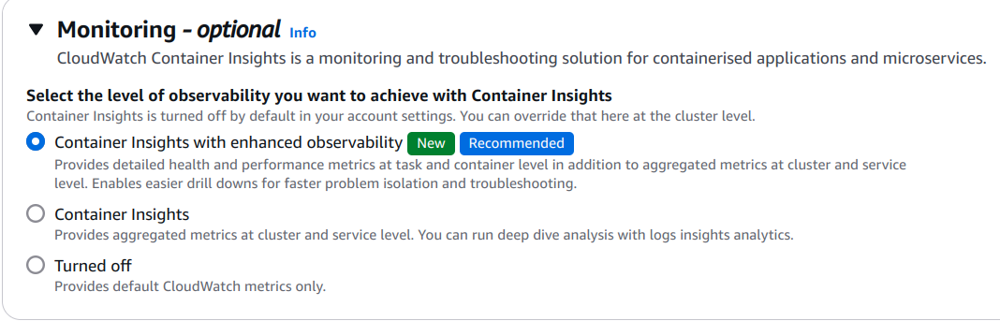

# Node.js Application with Docker and CI/CD Pipeline

 This project demonstrates how to set up a simple **Node.js** Application, containerize it using Docker, automate the build and deployment process with Jenkins, and deploy the application to AWS. 


## 🚀 **Features**

- **Basic Node.js app** built with Express.js
- **Dockerized Application** for portability and scalability
- **CI/CD Pipeline** using Jenkins to automate the build, test, and deployment processes
- **AWS Deployment** on ECS with Fargate for a fully managed container solution
- **Logging and Monitoring** via AWS CloudWatch

---

## 🛠️ **Technologies Used**

`Node.js` | `Docker` | `Jenkins` | `AWS ECS` | `AWS CloudWatch`  

- **Node.js**: Server-side JavaScript runtime environment
- **Express.js**: Fast, minimalist web framework for Node.js
- **Docker**: Containerization of the Node.js app
- **Jenkins**: Continuous Integration/Continuous Deployment (CI/CD) automation
- **AWS ECS (Elastic Container Service)**: For container orchestration with Fargate
- **AWS CloudWatch**: For application logging and monitoring

---

## 📜 **Table of Contents**

- [Installation](#installation)
- [Running Locally](#running-locally)
- [Docker Setup](#docker-setup)
- [Jenkins Pipeline](#jenkins-pipeline)
- [AWS Deployment](#aws-deployment)
- [Monitoring and Logging](#monitoring-and-logging)
- [License](#license)

---

## 📥 **Installation**

To get started with the Node.js application, follow the steps below:

1. **Clone the repository**:
   ```bash
   git clone https://github.com/architmadankar/devops-task-archit.git
   cd devops-task-archit
   ```

2. **Install dependencies**:
   Ensure you have [Node.js](https://nodejs.org/) installed, then run:
   ```bash
   npm install
   ```

---

## 🖥️ **Running Locally**

1. **Start the application**:
   ```bash
   npm start
   ```
   The app will be running at `http://localhost:3000`, and you'll see the "Hello World!" message in your browser.

2. **Testing the APP**:
   Open your browser or use a tool like Postman or CURL to send a GET request to `http://localhost:3000`.

---

## 🐳 **Docker Setup**

To run the application inside a Docker container:

1. **Build the Docker image**:
   ```bash
   docker build -t devops-task-archit .
   ```

2. **Run the Docker container**:
   ```bash
   docker run -p 3000:3000 devops-task-archit
   ```

3. Visit `http://localhost:3000` to confirm that the application is running in the container.

---

## 🔧 **Jenkins Pipeline**

This project includes a Jenkins pipeline to automate the following steps:

- Clone the source code from GitHub
- Build the Docker image
- Run basic tests on the application
- Push the Docker image to Docker Hub
- Deploy the application to AWS
```css
Note: There is a Jenkins.local file to test the application locally with Docker.
```
### **Jenkins Pipeline Configuration**

- The pipeline is defined in the `Jenkinsfile`. It uses stages such as **Clone Repository**, **Build Docker Image**, **Test Application**, **Push to Docker Hub** and **Deploy to AWS ECS**.
- You can view the Jenkins pipeline in the [Jenkinsfile](Jenkinsfile) located in the root directory.

To use this pipeline, ensure you have the **Docker**, **Git**, **AWS CLI**, and **Jenkins** set up with the necessary credentials for Docker Hub and AWS mentioned in **Jenkinsfile**.

---

## ☁️ **AWS Deployment**

The application can be deployed to AWS using **Elastic Container Service (ECS)** with **Fargate**. This provides a fully managed environment for running the application in containers without managing the underlying infrastructure.

### **Deployment Steps**

1. **AWS ECS with Fargate**:
   - Jenkins Groovy scripts for provisioning ECS and Fargate tasks are located in the main directory labelled as Jenkinsfile.
   
2. **Deploy to AWS**:
   - After provisioning your ECS instance, deploy the Docker image from Docker Hub to AWS ECS.

3. **Application URL**:
   - Once deployed, you can access the application via the public IP/ public DNS of your ECS instance.

---

## 📊 **Monitoring and Logging**

### **AWS CloudWatch**

- To enable Monitoring we have to enable Monitoring while creating **Elastic Container Service**
- This allows you to monitor logs and application performance in real-time.

### **Docker Logs**

If running locally in Docker, you can view logs with the following command:
```bash
docker logs <container_id>
```

---


## 📄 **License**

This project is licensed under the MIT License - see the [LICENSE](LICENSE) file for details.

---

## 🔗 **Links**

- **GitHub Repository**: [https://github.com/architmadankar/devops-task-archit](https://github.com/architmadankar/devops-task-archit)
- **Deployed Application**: [AWS](http://13.233.160.74:3000/)

---

This Project was created by **Archit Madankar** for the DevOps Intern Task for **Swayatt Drishtigochar**.! 🚀

